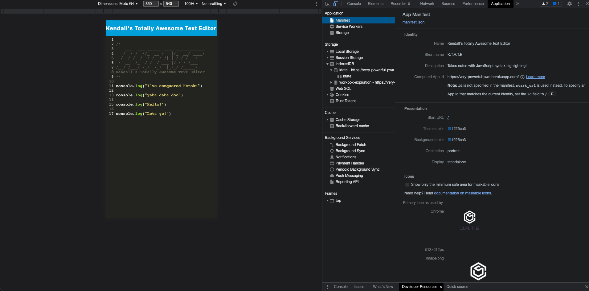
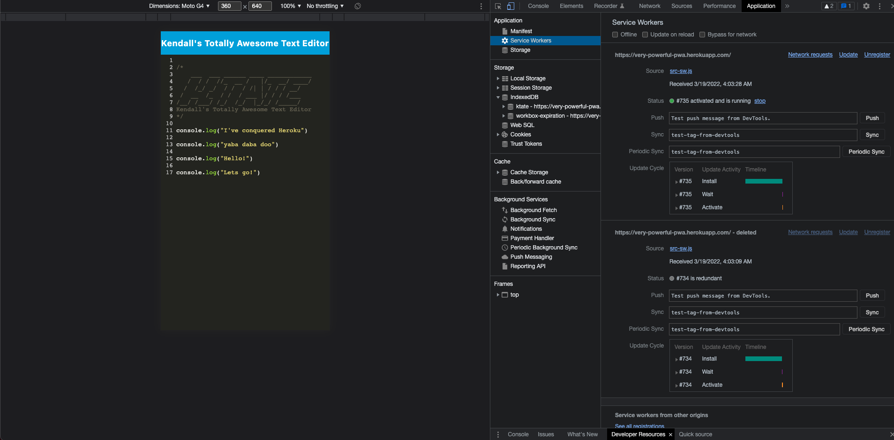
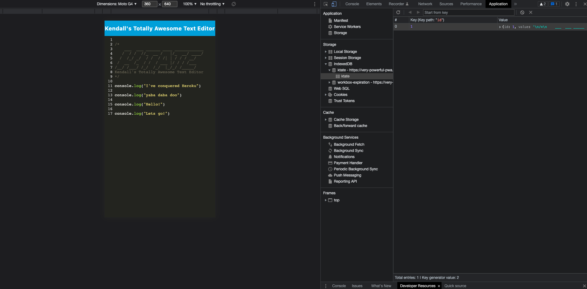

# Totally Awesome Text Editor 

  In this application, we have created a very basic downloadable text editor, similar to Atom or Brackets. This can come in handy just for psuedocode or if you have random notes to jot down. The applcation utilizes PWA criteria so that the application runs in your browser, even if you are offline.  

  # Table of Contents
  * [Installation](#installation)
  * [Usage](#usage)
  * [Contribution Guidelines](#contribution-guidelines)
  * [Tests](#tests)
  * [Acknowledgements](#acknowledgements)
  * [Questions](#questions)
  * [License](#license)

  ---
  ## Installations
  This app is deployed to heroku so technically, there are no installations needed. If the user would like to take a look at the code and application via the terminal. Following the node module installs and build, the user can run `npm run start`. 

  ## Usage
  This can be used as a very basic text editor that can be utilized across both online and offline platforms, if the offline version is installed. The indexDB will log all edits made. 
  
  Take a look at this short video for a walkthrough on how to use the application:

  

  

  

  

  ## Contribution Guidelines
  Nope!

  ## Tests
  No tests.

  ## Acknowledgements
  The code was created during a code-along with our TA Patrick Corcoran and the other students within our cohort. 

  ## Questions
  
  If you have any questions or would like to contact me regarding aspects of this project, I can be reached at:
  * GitHub: kvs1995
  * Email: kvscoding@gmail.com

  ## License: MIT
      This project is licensed under the [!MIT License](https://opensource.org/licenses/MIT).
